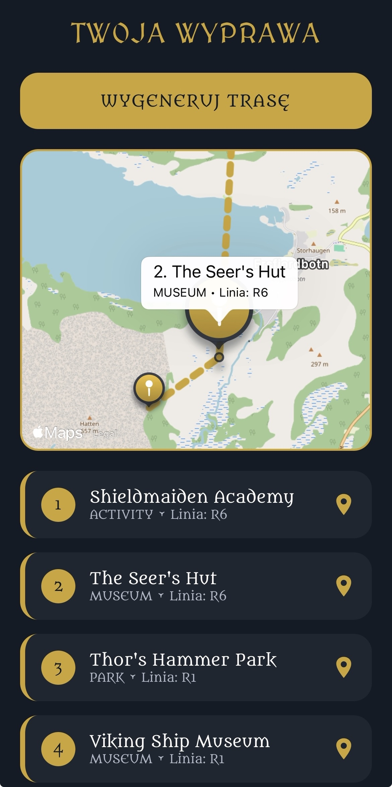
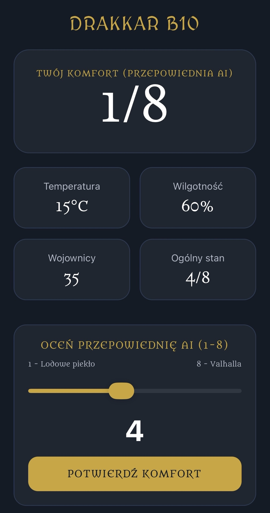
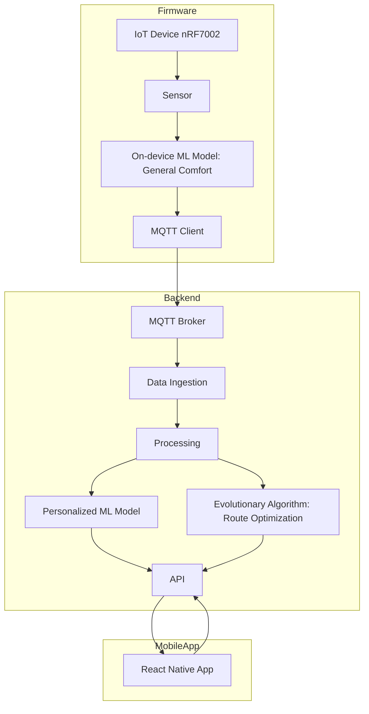

# Hacknarok AIOT - DrakkarTour

 This project was developed as part of an AIoT (Artificial Intelligence of Things) challenge under the theme Vikings' Smart City. As we all know, Vikings are knows for their love of travel - that's why, we decided to create a system that will make travel more comfortable for modern era vikings.
 
 It focuses on improving urban public transport experience by combining embedded systems, machine learning, and a mobile application ecosystem.

The system provides insights about bus occupancy, environmental conditions, and passenger comfort, while also offering personalized recommendations and optimized travel planning.

<a href="https://drive.google.com/file/d/1ey0MpxpdZ2O3ohUzNOIq7wxSWfGtFXbA/view?usp=sharing">
  Watch mobile app preview
</a>

  
  

  
  

---

## System Architecture

The project consists of three main components:
 - Firmware (Edge / IoT Device)
 - Backend (AI + APIs)
 - Mobile Application (Frontend)

---

## Key features

Firmware:
 - Displays bus insights in real time
 - LED-based comfort indicator (visual feedback system)
 - Distance sensor used for occupancy estimation
 - Heuristic model for passenger counting
 - On-device ML inference using XGBoost model for comfort prediction

Backend:
 - User login and authentication
 - Personalized comfort prediction model:
    - Uses demographic data (e.g., age, gender) and temperature + humidity.
    - Estimates individual comfort level in a bus environment
 - API for mobile application
 - Integration with ML inference pipeline

Optimization module:
 - Genetic algorithm-based route generator
 - Finds the optimal itinerary balancing:
   - Travel distance
   - Passenger comfort
   - Occupancy levels
   - Destination comfort

Mobile application:
 - User authentication system
 - Map of buses
 - Occupancy preview
 - Comfort level indicators
 - Personalized comfort predictions (from backend ML model)
 - Trip planner:
    - Generates optimized travel suggestions
    - Based on genetic algorithm results
  
Machine Learning Components
  - On-device (Firmware):
   - XGBoost model
   - Estimation of general comfort level
Backend:
  - Personalized comfort prediction model
  - ONNX runtime for optimized inference
Optimization:
  - Genetic algorithm for route planning
  - Multi-objective optimization (comfort + distance)

---

## Technologies

Firmware:
  - nRF7002Dk
  - nRF Connect SDK

Backend:
  - Python
  - FastAPI
  - ONNX Runtime

AI Model training:
 - Sklearn
 - XGBoost
 - Optuna

Frontend:
  - React Native
  - TypeScript

